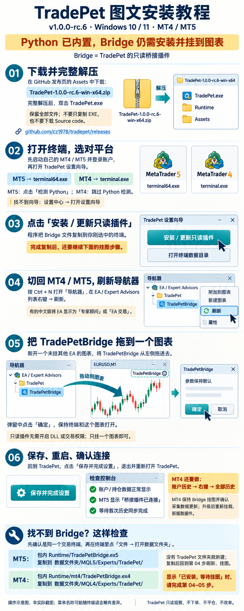

# TradePet 安装与升级说明

适用于 **1.0.0-rc.9 / Windows 10、11 x64**。支持 MT5 与 MT4；MT4 支持订单存档、有证据的部分平仓归集及实际报价回放。TradePet 不执行下单、平仓或改单。

`rc.9` 的本地修改更新复盘工作台的曲线、盈亏日历、月度表现、分类归因、策略规则表单与机会关联。保留 `rc.8` 的宠物旁入场原因、快速复盘与独立开关、已保存复盘档案、实际行情背景和 GitHub 更新提醒，继续内置 Python 和采集依赖。从更早版本升级后应核对所选终端，并按需安装、重新挂载包内的桥接插件。

旧版 `rc.5` 及更早版本仍需手动配置 Python；建议下载 `rc.9` 完整便携包。

## 图文快速安装

**Python 已内置，Bridge 仍需安装并挂到图表。** 点击“安装 / 更新只读插件”只会复制插件文件，还需在交易终端的导航器中刷新，然后把 `TradePetBridge` 拖到一个未挂其他 EA 的图表，点击“确定”。



[打开高清长图](docs/images/tradepet-rc6-install-guide.png)。图中界面为操作示意，菜单名称可能随终端语言略有差异；下文提供可复制的路径与详细步骤。

## 下载并启动

1. 打开 [GitHub 发布页](https://github.com/cz1978/tradepet/releases/tag/v1.0.0-rc.9)。
2. 在 Assets 中下载 `TradePet-1.0.0-rc.9-win-x64.zip`。`Source code` 是开发用源码，不是可运行安装包。
3. 将 ZIP **完整解压**到自己的应用目录，例如 `D:\Apps\TradePet-1.0.0-rc.9`。
4. 运行解压目录内的 `TradePet.exe`，跟随四步设置向导完成配置。不要在压缩包内直接运行，也不要只复制 EXE。

需要直接打开复盘分析时，可运行 `TradePet.exe --review`；先从托盘退出已运行的旧版助手。

便携包已包含 .NET 8、Python 和采集依赖，无需安装 .NET SDK 或 Python。保留同目录的 DLL、`Runtime` 和 `Assets` 文件夹。

发布页还提供 `SHA256SUMS.txt`。需要核对下载完整性时，在 ZIP 所在目录执行并与该文件比较：

```powershell
Get-FileHash .\TradePet-1.0.0-rc.8-win-x64.zip -Algorithm SHA256
```

该校验用于确认文件一致性，不代替数字签名。当前包未做代码签名；遇到 Windows 提示时先核对来源及哈希，不要关闭系统防护。

便携包中的 `LICENSE` 是 TradePet 的 MIT 许可证。允许个人使用、商用、修改和分发，包括收费分发；分发时须保留版权声明和许可声明。第三方组件适用各自许可证。`rc.3` 相比 `rc.2` 仅更新许可、文档和版本信息，安装与连接方式相同。

## 连接 MT5

### 1. 准备终端和 Python

- 安装并启动自己的 MetaTrader 5，登录要监控的账户。
- `rc.8` 便携包已内置 **64 位 Python 3.13** 和依赖，无需另装。旧版 `rc.5` 及更早发布包需自行安装 64 位 Python 3.13。
- 向导中选择“MT5”，选中对应 `terminal64.exe`。未自动发现时点击“浏览终端”。

每次只连接一个终端。需要完整交易复盘时，请使用 MT5 对冲账户；净额和交易所账户提供持仓及账户级风险监控。

### 2. 准备采集环境

新版便携包在向导中点击“检测 Python”即可。程序优先使用 `Runtime\python-runtime\python.exe`，无需联网安装依赖，也不受旧版用户环境影响。请保留整个 `Runtime` 目录；检测失败时，退出助手并将完整 ZIP 重新解压到新目录。内置环境的许可文件位于 `Runtime\python-runtime\LICENSE.txt` 及 `Lib\site-packages` 下各组件目录。

仅旧发布包或源码开发环境需要手动配置：在向导中检测 Python，缺少依赖时点击修复；自动路径不匹配时，选择已安装的 Python 3.13 的 `python.exe`。此方式需要联网下载 `Runtime\python\requirements.txt` 中固定版本的依赖。

修复会使用 `%LOCALAPPDATA%\TradePet\python\venv` 作为专用 Python 环境。也可在解压目录手动运行：

```powershell
powershell -NoProfile -ExecutionPolicy Bypass -File .\Runtime\setup-python.ps1 -PythonPath 'C:\路径\Python313\python.exe'
```

请将示例中的 Python 路径替换为实际安装位置。

### 3. 安装只读插件

1. 在向导中点击“安装 / 更新只读插件”。
2. 切回所选 MT5，按 `Ctrl+N` 打开“导航器”，在“EA / Expert Advisors（专家顾问或 EA 交易）”列表右键选择“刷新”。
3. 展开 `TradePet` 文件夹，将 `TradePetBridge` 拖到一个未挂其他 EA 的图表；弹窗中参数保持默认，点击“确定”，并保持终端和图表打开。只读插件无需开启 DLL 导入或交易权限。
4. 检查助手连接状态。图表对象和经济日历需要桥接插件连接成功。

插件安装位置为所选终端数据目录的 `MQL5\Experts\TradePet`。若未出现插件，在终端“文件 → 打开数据文件夹”核对是否选中了同一个终端。

手动安装备用方式：将便携包内的 `Runtime\TradePetBridge.ex5` 复制到上述 `MQL5\Experts\TradePet` 文件夹；没有 `TradePet` 文件夹时新建。然后重复刷新、挂图步骤。显示“桥接插件已安装，等待挂图”时，不能仅凭安装成功就跳过挂图。

### 4. 保存并检查

设置桌宠偏好后点击“保存并完成设置”。若刚更换平台、终端或修复 Python，从桌宠/托盘菜单退出助手后重新启动。保存设置只表示配置已记住，不代表已经连接成功。

首次历史同步需要时间，完成前统计可能尚不完整。请以控制台的连接、桥接与历史同步状态判断进度。

## 连接 MT4

1. 启动 MetaTrader 4 并登录账户。
2. 在向导中选择“MT4”，选中对应的 `terminal.exe`；MT4 不需要 Python。
3. 点击“安装 / 更新只读插件”。
4. 按 `Ctrl+N` 打开 MT4“导航器”，在“EA / Expert Advisors”列表右键刷新。展开 `TradePet`，将 `TradePetBridge` 拖到 **一个** 未挂其他 EA 的图表，参数保持默认并点击“确定”，保持图表打开。
5. 检查状态、保存设置；切换平台或终端后重新启动助手。

MT4 插件位于终端数据目录的 `MQL4\Experts\TradePet`，通过 `MQL4\Files` 中的本地快照传递数据，无需 DLL 或“允许实盘交易”。不要在多个图表同时运行本插件，以免重复写入快照。

手动安装备用方式：在 MT4“文件 → 打开数据文件夹”中找到 `MQL4\Experts`，新建 `TradePet` 文件夹并复制便携包内的 `Runtime\mt4\TradePetBridge.ex4`，然后刷新导航器并挂图。

MT4 支持账户、持仓、挂单、浮亏监控、订单历史复盘、M5 K 线及本地实际报价回放、图表计划、亏损区域和日报。升级后须重新挂载新版插件，并在账户历史中选择“全部历史”。已经读到的订单会持续存档；有 broker 票号关联证据的部分平仓按整笔持仓归集，全部平完后才计入完整交易，原票号及各次费用保留。缺少关联证据时保持独立；尚未读取的历史仍受终端加载范围影响。

Tick 回放需要同时运行 TradePet 和新版插件。挂图品种采集 Tick，其他打开图表和持仓品种每秒采样；只有真实秒级报价，没有采集到的时段不会补造。订单与报价存档保存在终端 `MQL4\Files\TradePet` 的 `order-archive.db` 和 `tick-archive.db` 中，迁移终端时一并复制；助手的复盘备份 ZIP 不包含这两份采集存档。历史 UTC 按当前服务器偏移换算，跨夏令时的实际持仓时长仍不能保证精确。经济日历使用 Forex Factory 公开周历（需联网），支持事前提醒，不提供实时公布值。实时数据超过 10 秒未更新、终端断线或插件被移除时显示过期状态。

首次运行需收到新报价以确定服务器时区；休市时可在 EA 参数 `InpServerUtcOffsetMinutes` 填入经纪商当前 UTC 偏移分钟数（例如 UTC+3 填 180），默认 10000 表示自动。已自动校准的偏移会在本机保留最多 7 天。

## 日常使用与快速复盘

- 右键桌宠或系统托盘图标，可打开控制台、交易计划、复盘分析、设置等入口。
- MT4、MT5 平仓后快速复盘只进入待处理队列，**不会自动弹窗**。空闲时右键选择“快速复盘”逐笔处理。
- 快速复盘不强制置顶、不自动抢焦点；“稍后”会在 10 分钟后重新入队，不会自动打开窗口。
- 快速复盘队列保存在当前进程内。退出后，历史交易仍可在“复盘分析 → 交易档案”查看并补写；保存过的复盘不会因退出丢失。
- 没有本次待处理交易时，“快速复盘”会进入复盘分析页。自动分析的原因和改进建议均可修改。
- 设置向导可从“设置中心 → 打开设置向导”重新进入。
- 首次打开控制台会显示 7 步流程引导，可跳过；以后从顶部“使用引导”重看。复盘页的“复盘使用引导”按查数据、逐笔还原、分析和改进四步说明，具体字段要求可悬停查看。

## 快速记录与更新提醒

- 入场后在宠物旁点选原因，再点击“记录原因”；也可展开手写补充或跳过。原因绑定当前账户与具体持仓，在交易档案中查看。
- 平仓后在宠物旁快速复盘，保存后进入“复盘分析 → 交易档案 → 已保存复盘”；长篇手写复盘保留为可选入口。
- 设置中心顶部的两个自动提示开关默认开启，可分别关闭；点击“保存设置”后会保留选择。历史同步不补弹提示，关闭自动提示后仍可从宠物菜单手动打开。
- 自动更新检查在启动时和每 6 小时读取项目 GitHub Releases，同一新版自动提醒一次。也可点击“检查更新”或“打开发布页”。只检查包含 Windows 便携包的版本，不会自动下载或安装，也不发送交易账户、持仓或复盘内容。
- 普通日报和完整 MD 包含服务器、账号等本地信息；对外分享可使用“公开分享 ZIP”并检查附件。截图不会自动脱敏，终端下拉框显示本机安装目录名称。

## 从旧版升级

1. 保存正在编辑的笔记，从桌宠或系统托盘右键菜单选择“退出天禄交易助手”。关闭控制台窗口可能只是隐藏窗口，不等于退出。
2. 在助手退出后，备份整个 `%LOCALAPPDATA%\TradePet` 文件夹，保存数据库、附件、设置、日志和日报。
3. 将新版 ZIP 解压到 **新目录**，运行其中的 `TradePet.exe`。应用会继续使用原来的本地数据目录。
4. 旧版首次升级可能显示设置向导；核对平台、终端和偏好并保存。按需点击“安装 / 更新只读插件”，在终端移除旧图表上的插件并重新挂载。
5. 若切换了连接配置或修复 Python，完成向导后重新启动助手。检查持仓、连接和历史同步状态正常后，再清理旧程序目录。
6. 若使用了桌面快捷方式或开机启动，更新为新版路径；开机启动可在新版设置里关闭再开启。

不要删除 `%LOCALAPPDATA%\TradePet` 来“卸载旧版”，否则会丢失本地数据。需要回退时退出新版，使用升级前的完整数据备份配合旧版程序恢复，避免混用数据库版本。

## 历史数据库修复（可选）

包内 `Runtime\tools\repair_history_database.py` 用于修复已知的历史日状态与风险采样重复或索引问题，不会自动运行或替换应用数据库。先退出助手并保留完整数据备份，再对数据库副本执行；输出必须是尚不存在的新文件。

在解压目录的 PowerShell 中运行，例如：

```powershell
.\Runtime\python-runtime\python.exe -X utf8 .\Runtime\tools\repair_history_database.py D:\Backup\tradepet-copy.db D:\Backup\tradepet-repaired.db
```

工具保留原始库，输出新数据库及 `.conflicts.json` 冲突归档，核对数据库完整性、外键和原始交易/复盘记录；校验失败会报错。它不能修复所有类型的数据库损坏，未报告成功的副本不要用于恢复。

## 常见问题

| 现象 | 处理方式 |
| --- | --- |
| 启动后没有新窗口 | 检查托盘是否已有助手。应用限制单实例；先退出旧进程，再运行新版。 |
| 找不到终端 | 先启动并登录终端，再刷新或浏览实际 EXE；确认 MT4 对应 `terminal.exe`，MT5 对应 `terminal64.exe`。 |
| 保存的终端已不存在 | 重新选择终端并保存。助手不会自动换到其他终端。 |
| MT5 Python 检测失败 | 新版内置环境：退出助手后重新完整解压 ZIP，保留 `Runtime\python-runtime`。旧包/开发环境：选择 64 位 Python 3.13，联网修复依赖后重启助手。 |
| 只读插件文件不完整 | 重新完整解压便携 ZIP，确认 `Runtime\TradePetBridge.ex5` 和 `Runtime\mt4\TradePetBridge.ex4` 存在。 |
| 等待桥接插件 / MT4 数据过期 | 确认插件挂在所选终端的图表上，终端已登录且保持运行；MT4 只挂一个图表。 |
| MT4 历史和日报为空 | 更新并重新挂载新版插件，账户历史选择“全部历史”，等待报价校时；休市时核实并填写 EA 的 UTC 偏移参数。 |
| 不想自动提示入场原因或快速复盘 | 设置中心顶部可分别关闭两个提示，再点击“保存设置”；关闭后仍可从宠物菜单手动打开。 |

反馈问题时可在 [GitHub Issues](https://github.com/cz1978/tradepet/issues) 提供版本号、Windows 版本、终端平台、复现步骤和已脱敏日志片段。不要上传完整数据库、账号信息或原始交易截图。

## 从源码构建

开发机需要 Git、.NET 8 SDK、MT4/MT5 自带的 MetaEditor 编译器，以及带 pip 的 Python（可用 `-PythonPath` 指定）。构建时需联网下载官方 Python 3.13 x64 嵌入包及依赖，用户运行生成的便携包无需安装 Python。

```powershell
git clone https://github.com/cz1978/tradepet.git
cd tradepet
.\scripts\build-release.ps1 `
  -Mt5MetaEditorPath 'C:\你的MT5目录\MetaEditor64.exe' `
  -Mt4MetaEditorPath 'C:\你的MT4目录\metaeditor.exe'
```

脚本编译两种只读插件、发布 .NET 应用并打包验证 Python 环境，默认输出到 `artifacts\TradePet-win-x64`。可传 `-OutputDirectory 'D:\Builds\TradePet-win-x64'` 改变输出位置，避免覆盖正在运行的程序。仅运行 `dotnet publish` 不会生成完整 Python 便携环境，发布时必须使用 `scripts\build-release.ps1`。

不传编译器参数时，MT5 默认使用 `C:\Program Files\WeTrade MetaTrader 5 Terminal\MetaEditor64.exe`；MT4 从 Program Files 查找。完整发布包需要两种编译器，即使运行时只选择一种平台。

```powershell
dotnet test TradePet.sln --configuration Release
```

Python 采集测试可使用已安装的 Python 3.13 执行：

```powershell
python -m unittest discover -s python -p "test_*.py" -v
```
